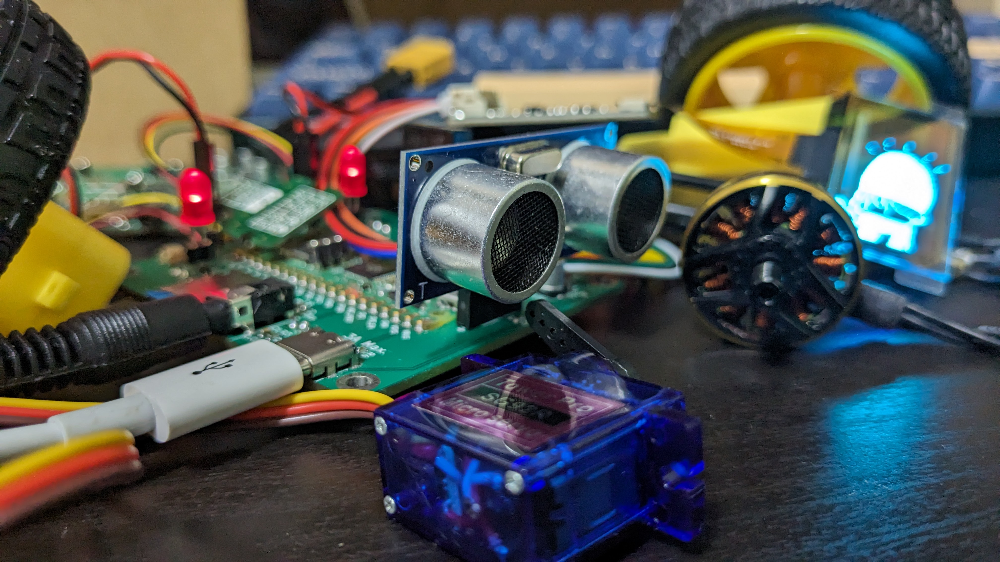
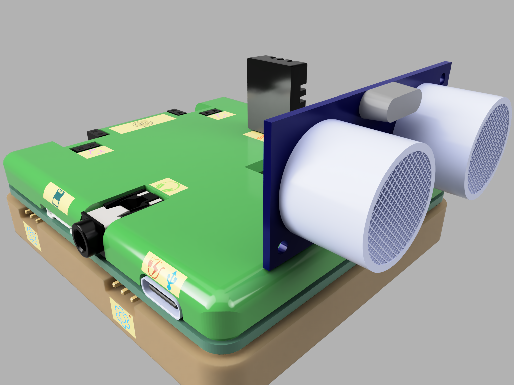

# Turtle Pico - Making electronics work easier and more widely

The Turtle Pico Board which looks like a turtle, uses connectors on the board for easy connection to components. The board is equipped with Raspberry Pi Pico W, and programming is easy with Micropython.

When you want to build something, just buy the components and plug them into this board! That's all there is to wiring. Then all you have to do is write the programming.

Don't know how to program? Don't worry. You can find some programming examples in the official repository.

## Specific & Environment build

Please see the specifications for a summary of each use.

The specifications are available in Japanese and English, so you can check them in the language of your choice.

[English](board/main/specific/specific_en.pdf)

[Japanese](board/main/specific/specific_jp.pdf)

## Case

Turtle Pico Package is available in [**board/main/Case**](https://github.com/Jin-Neuron/Turtle-Pico/tree/master/board/main/Case).

## Purchase your board

Turtle Pico boards can currently only be purchased from [PCBWay's Shared Project Page](https://www.pcbway.com/project/shareproject/Turtle_Pico_Board_c183b11f.html). Once officially released, we plan to make it available for purchase at various online stores. 

## License

This repository includes multiple components with different licenses.

Please reffer to [LICENSE File](License.txt).
